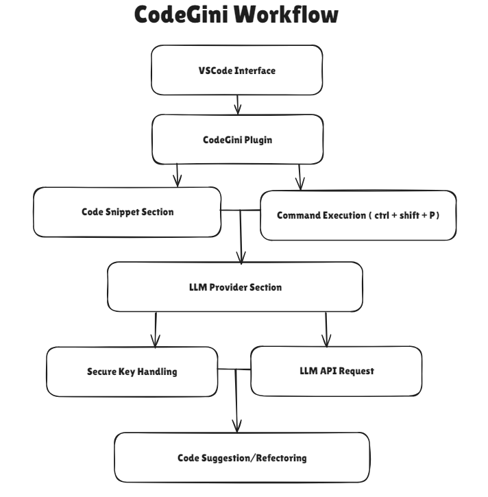

<p align="center">
  <strong><h1 style="font-size: 60px;" align="center">CodeGini</h1></strong>
</p>

# LLM Code Suggestion Plugin for VSCode

This VSCode plugin integrates with multiple large language models (LLMs) such as Hugging Face, AWS Llama, and OpenAI GPT-4 to provide advanced code suggestions, refactoring, and completion features directly in your IDE.



## Features

- **Multiple LLM Provider Support**: Supports Hugging Face (StarCoder), AWS (Llama), and OpenAI (GPT-4).
- **Code Suggestions**: Get optimized code suggestions, completions, and refactoring recommendations from LLMs.
- **Customizable Configuration**: Set your preferences for `maxTokens`, `temperature`, and easily switch between different LLM providers.
- **Secure API Key Handling**: Uses VSCode's secret storage API to securely store and manage API keys.
- **Seamless IDE Integration**: Provides inline code suggestions directly within the VSCode editor.

---

## Table of Contents

- [Installation](#installation)
- [Usage](#usage)
- [Configuration](#configuration)
- [How It Works](#how-it-works)
- [Internal Workings](#internal-workings)
- [Troubleshooting](#troubleshooting)

---

## Installation

### Prerequisites
1. Ensure you have **Visual Studio Code** installed.
2. You'll need API keys for the LLM providers you want to use (Hugging Face, AWS, OpenAI).

### Steps
1. Clone or download this repository.
   ```bash
   git clone https://github.com/Dakshya52/CodeGini
   ```
2. Open the project folder in **Visual Studio Code**.

3. Run the following command to install necessary dependencies:
   ```bash
   npm install
   ```

4. Press `F5` to run the extension in a new VSCode window for testing and development purposes.

5. To use the extension in your main environment, build the plugin and install it directly in VSCode:
   ```bash
   npm run build
   ```

6. Install the resulting `.vsix` file in your main VSCode instance by dragging and dropping it into the Extensions panel or using the **Install from VSIX** option.

---

## Usage

### Step 1: Select Code Snippet
1. Open any code file in VSCode.
2. Select the code snippet you want to optimize or refactor.

### Step 2: Run the Command
1. Press `Ctrl + Shift + P` or `Cmd + Shift + P` to open the Command Palette.
2. Type `CodeGini: Suggest Code` and select it.

### Step 3: Choose LLM Provider
1. You'll be prompted to select one of the available LLM providers:
   - Hugging Face (StarCoder)
   - AWS Llama
   - OpenAI GPT-4
2. Select the provider of your choice.

### Step 4: Provide API Key
- If you are using the provider for the first time, the plugin will ask you to enter your API key.
- The key will be securely stored in VSCode's secret storage.

### Step 5: View the Suggested Code
- Once the plugin fetches the suggestion, it will replace the selected code with the new, optimized version.
- If no suggestion is found, an error message will be shown.

---

## Configuration

You can configure various settings in VSCode to control how the plugin interacts with LLMs.

1. **`maxTokens`**: Maximum number of tokens to generate in the LLM response.
   - Default: `200`
   - Example: Increase to 500 tokens for larger code completions.
   
2. **`temperature`**: Controls the randomness of the LLM response. Higher values (closer to 1) mean more randomness, while lower values (closer to 0) provide deterministic responses.
   - Default: `0.3`
   - Example: Set to `0.7` for more creative code suggestions.

### How to Configure
1. Go to `File > Preferences > Settings`.
2. Search for `LLM Plugin` in the settings.
3. Adjust the `maxTokens` and `temperature` values according to your needs.

Alternatively, you can edit these settings directly in the `settings.json` file:
```json
{
  "llmPlugin.maxTokens": 200,
  "llmPlugin.temperature": 0.3
}
```

---

## How It Works

### Overview
This plugin communicates with various large language models (LLMs) to provide code suggestions directly inside your VSCode environment. The extension uses `axios` to send API requests to the selected LLM provider (Hugging Face, AWS, or OpenAI), retrieves suggestions, and replaces the selected code in the editor with the improved version.

1. **Code Snippet Selection**: The user selects a portion of code.
2. **Command Execution**: The user runs the `CodeGini: Suggest Code` command via the Command Palette.
3. **LLM Provider Selection**: The plugin prompts the user to choose an LLM provider.
4. **API Key Handling**: If not previously provided, the plugin asks for the API key and securely stores it using VSCode's `secretStorage` API.
5. **API Request**: The plugin sends a request to the selected LLM provider, including the selected code snippet, and receives an optimized code suggestion.
6. **Suggestion Application**: The suggested code replaces the selected code in the VSCode editor.

---

## Internal Workings

### Key Components

1. **Provider Selection**
   - The plugin supports multiple LLM providers (Hugging Face, AWS, and OpenAI). It dynamically adjusts API URLs, request formats, and response parsing based on the selected provider.
   - The provider is chosen via the `vscode.window.showQuickPick` method.

2. **Secure API Key Management**
   - API keys are securely stored using VSCode’s `secretStorage` API, ensuring that sensitive information is not stored in plain text.
   - When a provider is used for the first time, the plugin prompts the user to input the API key, which is stored securely for future use.
   
   ```javascript
   const secretStorage = context.secrets;
   let apiKey = await secretStorage.get(provider);
   if (!apiKey) {
     apiKey = await vscode.window.showInputBox({ prompt: `Enter your API key for ${provider}` });
     await secretStorage.store(provider, apiKey);
   }
   ```

3. **API Request Construction**
   - The `getSuggestions` function forms different API requests depending on the selected LLM provider. It handles request body structure, URL endpoints, and token limits based on user configuration.
   
   ```javascript
   if (provider === 'Hugging Face') {
     apiUrl = 'https://api-inference.huggingface.co/models/bigcode/starcoder';
     requestBody = {
       inputs: `# Instruction: Provide a concise, well-optimized solution for the following code or task.\n\n${codeSnippet}`,
       parameters: { max_new_tokens: maxTokens }
     };
   } else if (provider === 'AWS Llama') {
     apiUrl = 'https://api.aws.com/llama/generate';
     requestBody = { prompt: codeSnippet, max_tokens: maxTokens };
   } else if (provider === 'OpenAI GPT-4') {
     apiUrl = 'https://api.openai.com/v1/completions';
     requestBody = {
       prompt: `Optimize and refactor the following code:\n\n${codeSnippet}`,
       max_tokens: maxTokens,
       temperature: temperature,
       model: 'gpt-4'
     };
   }
   ```

4. **LLM Response Handling**
   - Once the API call returns a response, the plugin handles the different response structures from each provider, extracts the suggested code, and replaces the selected snippet with the new suggestion.
   
   ```javascript
   if (provider === 'Hugging Face') {
     return response.data[0].generated_text.split('/*')[0]; 
   } else {
     return response.data.choices[0].text;  // OpenAI and AWS response structure
   }
   ```

5. **Configuration and Customization**
   - Users can customize the number of tokens (`maxTokens`) and temperature for the LLM requests. These settings can be adjusted in VSCode’s settings panel or directly in `settings.json`.
   
   ```javascript
   const config = vscode.workspace.getConfiguration('llmPlugin');
   const maxTokens = config.get('maxTokens') || 200;
   const temperature = config.get('temperature') || 0.3;
   ```

---

## Troubleshooting

1. **No API Key Found**: If you haven't provided an API key, the plugin will prompt you to enter one. Ensure that you have a valid API key for the selected LLM provider.
   
2. **Invalid API Key**: If you receive an error regarding an invalid API key, ensure that the key you entered is correct. You can update it by deleting the stored key via VSCode's command `Developer: Toggle Developer Tools` and rerunning the command.

3. **Error Fetching Suggestions**: If the plugin encounters an issue while fetching suggestions, ensure that:
   - You have an active internet connection.
   - The LLM API you're connecting to is reachable.
   - The API key and configuration are valid.

4. **Inconsistent Suggestions**: If the code suggestions seem too random, try lowering the `temperature` value in the plugin's settings.

---

## Future Enhancements

- **Real-Time Code Suggestions**: Implement real-time inline suggestions similar to IntelliSense.
- **More LLM Integrations**: Add support for other LLM providers like Google PaLM or Anthropic Claude.
- **Debugging Assistance**: Provide debugging and error-handling suggestions based on the context of the code.

---

This plugin provides a powerful way to harness the capabilities of large language models directly within your coding environment, allowing for enhanced productivity and optimized code generation.

